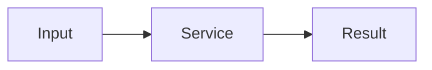

## The problem

Write the client context and the operational problem here.

## What we built

Describe the product, important workflows, and technical boundaries.

### Supported Markdown

- Headings, paragraphs, lists, links, images, and blockquotes
- Tables, task lists, and strikethrough through GitHub Flavoured Markdown
- Syntax-highlighted fenced code blocks
- Mermaid diagrams using a `mermaid` fenced code block
- Callouts using `<aside class="callout">...</aside>`
- Toggles using `<details><summary>Title</summary>...</details>`
- Local video using `<video controls src="/case-studies/example.mp4"></video>`
- Local audio using `<audio controls src="/case-studies/example.mp3"></audio>`
- Trusted embeds using an `<iframe>` with a title and HTTPS source

Store local media under `public/case-studies/` and reference it from `/case-studies/filename.ext`.



```ts
export const example = "Syntax-highlighted code";
```

<aside class="callout">
  <strong>Callout title</strong>
  <p>Use callouts for constraints, decisions, or publication notes.</p>
</aside>

<details>
  <summary>Expandable section</summary>

  Add supporting detail here.
</details>
