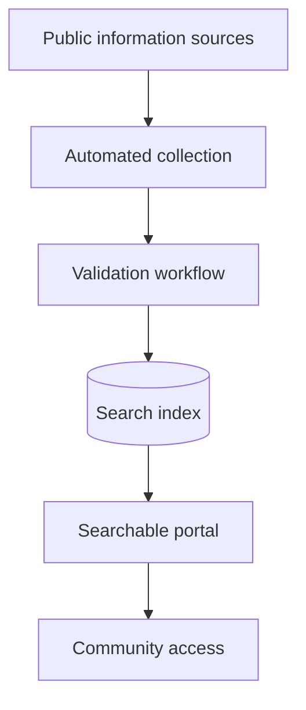

## The problem

Welfare scheme information was spread across different sources. That made relevant support harder to discover for underserved communities.

## What we built

In collaboration with IITR, NST Studio built a central searchable portal supported by automated data collection.

## Platform components

- Django application layer
- Puppeteer-based collection workflows
- Docker-based deployment
- AWS infrastructure

> Publication details and outcome metrics will be expanded after partner confirmation.
