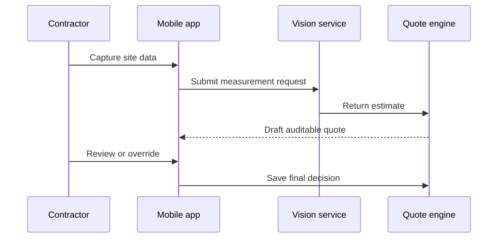

## The problem

Painting contractors measured surfaces manually. The process slowed quoting and introduced inconsistent estimates.

## What we built

NST Studio built an AI estimation platform using computer vision. Contractors can review and override results, and every quote remains replayable and auditable.

## Product principles

1. AI proposes an estimate.
2. A contractor remains in control.
3. Inputs and overrides stay attached to the quote.
4. A quote can be replayed for review.

  
Why human review is built in

  Field conditions vary. The workflow keeps the contractor as the final decision-maker while preserving the AI output and any subsequent override.

