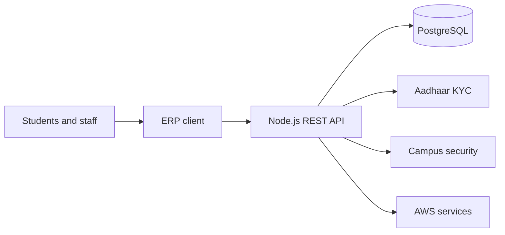

## The problem

A university serving more than 5,000 students operated workflows across more than 25 departments using paper records and manual coordination.

> Metrics and project details on this page are placeholders pending final client publication approval.

## What we built

NST Studio built a production ERP with more than 100 REST APIs, Aadhaar KYC, and face-recognition support for campus security.

| Area | Delivery |
| --- | --- |
| Operations | Shared workflows across departments |
| Identity | Aadhaar KYC integration |
| Campus security | Face-recognition workflow |
| Platform | REST APIs backed by PostgreSQL and AWS |

## System view



## Delivery controls

- [x] Mentor architecture review before implementation
- [x] Pull-request review before merge
- [x] Deployment documentation
- [ ] Final client approval for public metrics

<aside class="callout">
  <strong>Result</strong>
  <p>99.8% uptime and 80% less manual administration. These figures remain marked as placeholders until client confirmation.</p>
</aside>

<details>
  <summary>Illustrative API response</summary>

  The snippet below demonstrates how code is rendered. It is not production client code.

  ```ts
  type ServiceHealth = {
    status: "healthy" | "degraded";
    checkedAt: string;
  };

  export function health(): ServiceHealth {
    return { status: "healthy", checkedAt: new Date().toISOString() };
  }
  ```
</details>
