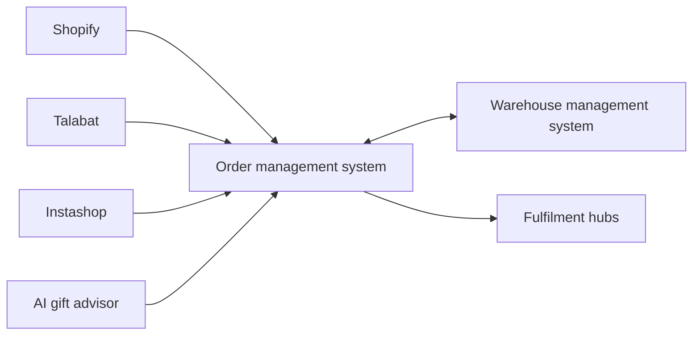

## The problem

A 60-minute gift delivery operation needed inventory and orders to stay aligned across hubs, its storefront, warehouse tooling, and third-party marketplaces.

## What we built

NST Studio built a custom order management system connected to Shopify, a warehouse management system, Talabat, and Instashop. The product also includes an AI gift advisor.

## Integration coverage

| System | Role |
| --- | --- |
| Shopify | Storefront orders |
| WMS | Inventory and warehouse operations |
| Talabat | Marketplace orders |
| Instashop | Marketplace orders |
| AI gift advisor | Assisted product discovery |

<aside class="callout">
  <strong>Publication note</strong>
  
Detailed performance and operational metrics will be added after client confirmation.

</aside>
